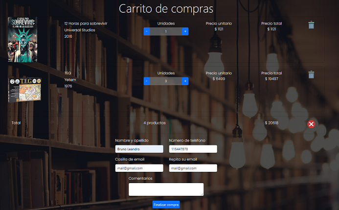

# Proyecto E-Commerce

Proyecto realizando por Bruno Kichinovsky para la comision 34825 del curso de `React JS` en [Coderhouse](https://www.coderhouse.com/)

## Descripción
El proyecto contiene las funciones principales de una tienda online. 
 - Pagina principal con todos los productos disponibles
 - Barra de navegación con acceso a los distintas categorias para ver los productos disponibles junto a breve información
 - Acceso al detalle de cada Item y posibilidad de seleccionar cantidad para agregar al carrito de compras
 - El Carrito de compras cuenta con la siguiente información
   - Detalle de productos cargados con la posibilidad de modificar su cantidad, ver costo tanto unitario como total del mismo y la opción de eliminarlo del carrito
   - Resumen con la cantidad total de productos cargados y costo
   - Botón para vaciar al mismo
   - Formulario de contacto para poder finalizar la compra
    
- Base de datos con las siguientes colecciones
  - Clientes: se almacenan los distintos clientes que van realizando compras en el sitio. Se utiliza como campo único la casilla de mail: 
    - De existir se actualizan los campos nombre y télefono
    - De no existir se agrega el cliente a la tabla
  - Items: Cuenta con los productos que hay en stock
  - Compras: registro de compras efectuadas, con información del cliente y productos seleccionados entre otras cosas


## Características

El sitio cuenta entre otras cosas con
- Contexto
- Ruteo y navegación
- Firebase
- Eventos
 
## Procesos principales

Algunos de los procesos con que cuenta el sitio son los siguientes

`itemListContainer`
El contenedor mencionado posee el siguiente código que permite obtener el listado de productos. De existir el parámetro id se filtran los correspondientes a la categoría elegida


```js
const [items, setItems] = useState([]);

  const { id } = useParams();

  useEffect(() => {
    const db = getFirestore();
    let itemsCollection = collection(db, 'items');
    if (id) {
      itemsCollection = query(itemsCollection, where('tipo', '==', id));
    } 
    getDocs(itemsCollection).then((snapshot) => {
      setItems(snapshot.docs.map((doc) => ({ id: doc.id, ...doc.data() })));
    });
  },);
}
```

`ItemDetailContainer`
En este contenedor encontraremos el siguiente código que nos permite obtener el detalle, de existir un valor de id, del item solicitado o de todos los items existentes en la tienda

```js
useEffect(() => {
    const db = getFirestore();
    if (id) {
      const itemDet = doc(db, "items", id);
      getDoc(itemDet).then((snapshot) => {
        if (snapshot.exists()) {
          setItemsDetails({ id: snapshot.id, ...snapshot.data() });
          setAlineacion("justify-content-center");
        }
      });
    } else {
      const itemsCollection = collection(db, "items");
      getDocs(itemsCollection).then((snapshot) => {
        setItemsDetails(
          snapshot.docs.map((doc) => ({ id: doc.id, ...doc.data() }))
        );
      });
    }
  }, [id]);
```


`CartContext`

Dentro del contexto encontramos distintos elementos y funciones. Por ejemplo cart que es donde se almacena el carrito, cartCant que es la cantidad de elementos que posee y cartCosto que es el costo total del mismo. Ademas nos encontramos con las funciones que nos permiten manipular el contenido del mismo, ya sea sumar / restar unidades como eliminar items o vaciar completamente el carrito.

```js
const addToCart = (obj, cant) => {
    let itemInCart = cart.find((el) => el.id === obj.id);

    if (cart.find((el) => el.id === obj.id)) {
      const index = cart.findIndex((object) => {
        return object.id === itemInCart.id;
      });
      cart[index].cantidad = cant;
      updCart();
    } else {
      obj.cantidad = cant;
      setCart((cart) => [...cart, obj]);
    }
  };

  const remFromCart = (obj) => {
    let itemInCart = cart.find((el) => el.id === obj.id);

    if (cart.find((el) => el.id === obj.id)) {
      const index = cart.findIndex((object) => {
        return object.id === itemInCart.id;
      });
      cart.splice(index, 1);
      updCart();
    }
  };
  
  const clearCart = () => {
    cart.splice(0);
    setCart([]);
  }
```
`Cart`

Dentro de este componente encontraremos funciones que nos permiten ver el contenido del carrito y finalizar la compra. En este último paso tambien sumamos una funcion que nos permite incoporar los clientes a una tabla, validando si estaban ingresados previamente o no. En el caso de existir se actualizan los datos para guardar los últimos cambios

```js
const q = query(baseClientes, where("email", "==", key.email));
    getDocs(q).then((snapshot) => {
      if (snapshot.docs.length > 0) {
        setClienteExistente(
          snapshot.docs.map((doc) => ({
            id: doc.id,
            email: key.email,
            nombre: key.nombre,
            telefono: key.telefono,
          }))
        );
      } else {
        addDoc(baseClientes, {
          email: key.email,
          nombre: key.nombre,
          telefono: key.telefono,
        });
      }
    });

addDoc(baseCompras, datosCompra).then((snapshot) => {
      setId(snapshot.id);
      setEmail(key.email);
      clearCart();
    });
```

## Agradecimientos
Agradezco tanto al profesor Felix Blanco como a los tutores por la enseñanza y el apoyo brindado durante la cursada

## Contacto / Sugerencias
Bruno Kichinovsky

brunokichi@gmail.com

[Linkedin](https://www.linkedin.com/in/bruno-leandro-kichinovsky/)

